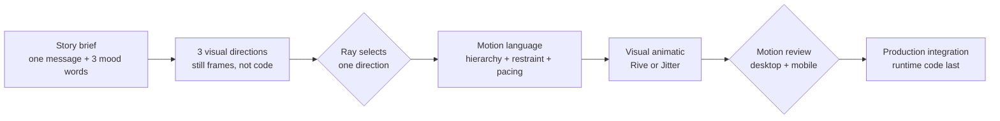

# Monoskill hero animation: taste before tweening

## Decision

Approve a reset of the hero-animation work around a creative-direction gate, not another library swap.

Recommended stack:

1. **Impeccable `shape`** for the task-specific creative brief and 2–4 visual directions.
2. **iart.ai `motion-art-direction`** for motion hierarchy, restraint, pacing, and a written motion-language spec.
3. **Rive** for the selected hero's visual authoring and interactive web runtime.
4. **Jitter** only for fast animatics or a non-interactive fallback.
5. **GSAP** only if the approved direction still needs DOM-native orchestration after the visual design is proven.

Do not use Theatre.js for this production attempt. Its visual timeline is conceptually useful, but its official repository has not received a code push since August 2024. It would add framework risk without adding art direction.

## What failed

The previous work solved the mechanism—elements moved on a coordinated timeline—but never established a visual language. It skipped the steps that decide:

- what the viewer should notice first;
- what should remain still;
- how the flood should feel rather than merely move;
- how one object visibly becomes another;
- what visual references define the quality bar;
- what an unacceptable result looks like.

That is why changing easing curves or animation libraries did not improve the result. The code was answering questions the design process had never asked.

## The useful skills

### Impeccable: the process router

Impeccable is a strong example of the *monoskill pattern*. Its root skill stays relatively compact and routes into progressively loaded modes and references. It groups many related design capabilities behind one discoverable entry point instead of flooding the agent with every instruction at once.

For this work, the important path is not its generic `animate` guidance. It is:

`shape → visual probes → direction confirmation → craft/overdrive → browser review → polish`

`shape` requires a task-specific brief before code and, for ambiguous high-fidelity work, multiple visual-direction probes. `overdrive` requires distinct directions, a chosen direction, and iteration against the running result. We bypassed those gates.

### motion-art-direction: the missing judgment layer

The [`motion-art-direction` skill](https://github.com/iart-ai/motion-design-skills/tree/main/skills/motion-art-direction) is the strongest motion-specific skill found. It sits above GSAP, Lottie, shaders, or a runtime and requires:

- one audience, one message, one platform, and exactly three mood adjectives;
- one consistent easing vocabulary and timing unit;
- a hero/support/texture hierarchy with exactly one hero per frame;
- an explicit restraint pass naming what does **not** move;
- a pacing map with tension, release, holds, and a single “wow” moment;
- direction notes that describe intent before keyframes.

This is worth installing. It does not replace Impeccable; it makes the motion portion of Impeccable's process much more specific.

### design-with-taste: useful critic, wrong director

The [`design-with-taste` skill](https://github.com/cristicretu/family-taste-skill/tree/main/skills/design-with-taste) has a valuable rule—“we fly instead of teleport”—and strong guidance about shared elements, spatial continuity, and selective delight. It is principally product-interface taste, however, not brand-motion art direction. Use it as a critique pass, not as the primary director for the hero.

### General art direction: useful brief discipline

The [`rampstack art-direction` skill](https://github.com/rampstackco/claude-skills/tree/main/skills/art-direction) contributes two useful constraints: force named visual references instead of saying “modern, clean, minimal,” and review the treatment early because late corrections compound. The motion-specific skill is more directly actionable here.

## The useful authoring systems

| System | What it changes | What it does not change | Recommendation |
|---|---|---|---|
| **Rive** | Gives us a visual editor, timelines, state machines, responsive vector animation, and a designer/developer contract through data binding. | It does not choose the art direction. Production `.riv` export requires a paid plan. Its built-in agent exists, but external-agent MCP is still described by Rive as exploratory. | **Best production candidate after direction approval.** |
| **Jitter** | Gives us a fast visual motion editor, comments, and Lottie/WebM/video export. It is well suited to an animatic the user can judge before integration. | Lottie is an exported asset, not a semantic DOM transformation; complex responsive or data-driven behavior is less natural. | **Best fast proof surface.** |
| **GSAP** | Excellent deterministic runtime control over the existing DOM. | No visual authoring, no composition, no review gate, no taste. | Keep only as a possible integration layer. |
| **Theatre.js** | Adds an in-project visual sequence editor and exports timeline state to production code. | No art direction; current maintenance risk. | Do not adopt for this attempt. |
| **Spline** | Strong visual authoring for interactive 3D and web embeds. | Our story is a 2D information transformation; 3D would invite decoration over clarity. | Wrong lane. |

Rive's official documentation confirms that state machines visually connect timelines and transitions for web/app use, while data binding creates a contract between editor elements and runtime code. Its current pricing makes the editor free to explore but requires Cadet or higher to export `.riv` files for production. [State machines](https://rive.app/docs/editor/state-machine/state-machine), [data binding](https://rive.app/docs/editor/data-binding/overview), [pricing](https://rive.app/pricing).

Jitter's official help center lists Lottie, GIF, and MP4 on the free plan and frames Lottie as a lightweight scalable web format; paid tiers add WebM, higher resolution, transparency, and other export options. [Jitter export documentation](https://help.jitter.video/en/articles/5369843-export-your-work).

Theatre.js's official docs show the right kind of visual feedback loop—a Studio with a sequence editor whose exported state can be used without Studio in production—but the maintenance signal makes it a poor new dependency here. [Studio](https://www.theatrejs.com/docs/0.5/manual/studio), [production state](https://www.theatrejs.com/docs/latest/api/core), [repository](https://github.com/theatre-js/theatre).

## Proposed quality gate

No animation code begins until all of the following exist:

1. A one-line message: **Too many individually installed skills flood agent context; one monoskill preserves access with radically less discovery context.**
2. Exactly three mood adjectives. Proposed starting point: **abundant, magnetic, clarifying**.
3. Three named reference works with one sentence each explaining what to borrow.
4. Three materially different full-frame visual directions at desktop and mobile proportions.
5. A selected direction and a written rejection reason for the other two.
6. A motion-language spec naming hierarchy, easing family, base timing unit, transition family, stagger, restraint, and one “wow” moment.
7. A short visual animatic reviewed at normal speed and half speed before it touches the site.

The animatic must tell one continuous physical story:

- the 47 skills are legible enough to read as a costly field, not decorative confetti;
- the rising context field visibly belongs to those skills;
- the individual skills travel into the already-visible Monoskill object;
- Monoskill remains the same persistent object throughout the transformation;
- the context level falls as the transformation completes;
- the final frame has a dominant focal point, generous negative space, and a readable claim.

## Recommendation

Adopt the process stack now. Install `motion-art-direction` into the project, keep Impeccable as the router, and use the next session to produce three visual directions—not animation code.

For the production mechanism, start with Rive if we are willing to use its editor and pay for production export. If not, use Jitter for the animatic and return to GSAP only after the visual direction is approved. The runtime decision is secondary; the non-negotiable change is moving taste decisions ahead of implementation.
